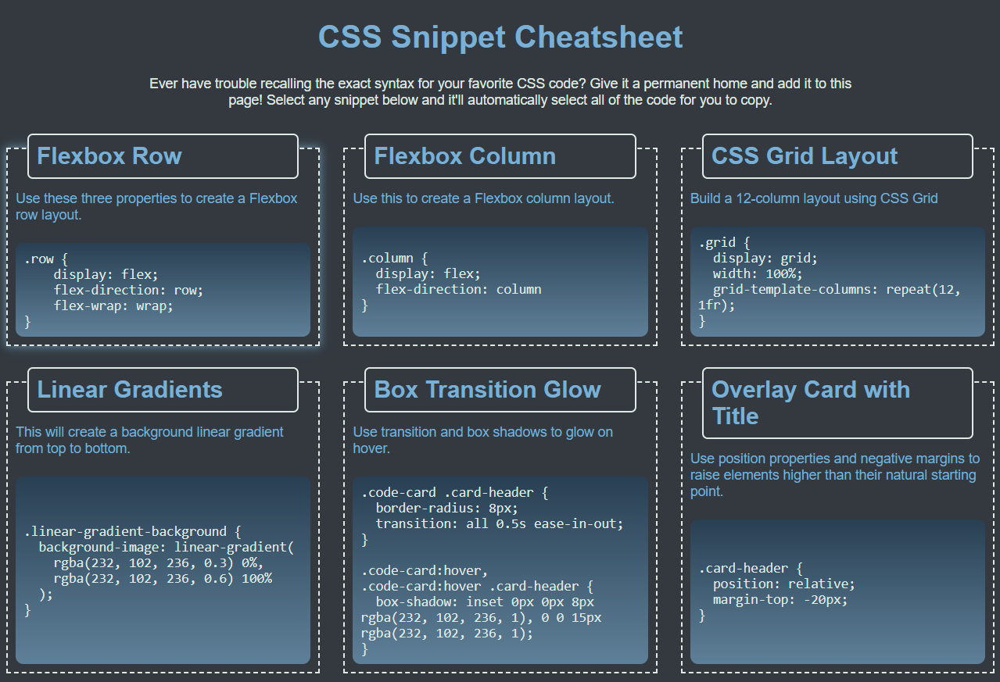

# css-snippets-mini-project

## Description

This is a project for UW bootcamp in which a number of useful CSS snippets are organized into cards, which can then be selected and copied into any of our own code.

## Installation

N/A

## Usage

This page was built to be responsive on multiple screen sizes. By clicking anywhere on any of the code snippets in the cards, the entire snippet will be selected for easy copying.

Link to deployed application: https://ktunebe.github.io/css-snippets-mini-project/

## Credits

Carolina Blue color code is available publicly at https://teamcolorcodes.com/north-carolina-tar-heels-colors/

## License

N/A